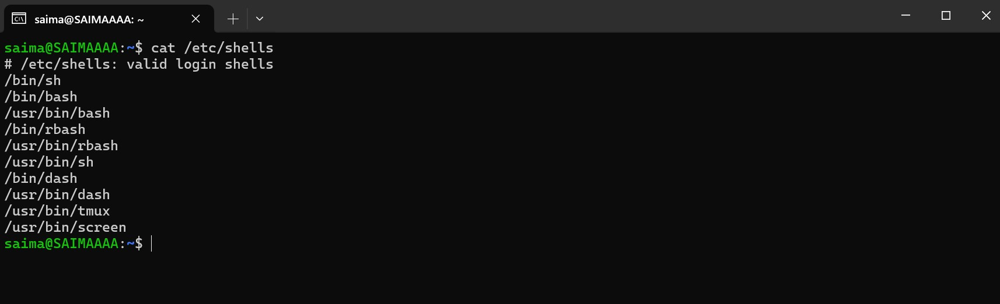
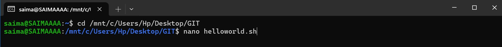
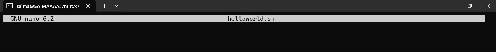
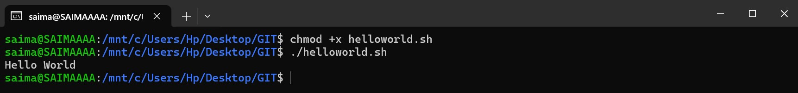

## <span style="color:rgb(94, 76, 175); ">MarkDown Language - Readme.md</span>

---

### <span style="color:rgb(62, 20, 113);">1. Checklists of Topics in Training</span>

- [x] Linux Shell Scripting Basics
- [x] Vim Editor Basics: Navigation, Text Editing
- [ ] GTKWave
- [x] Git Workflow and Commands
- [ ] Verilator
- [x] Markdown Language
- [ ] MakeFiles


### <span style="color:rgb(62, 20, 113);">2. Shell Scripting Tutorial</span>

<p align="center">
  
</p>


#### :page_facing_up:  Shell Scripting
Shells are **interactive**, executing commands entered by the user. To automate repetitive tasks, we can write commands in a **Shell Script** (`.sh` file) to avoid retyping. Shell scripting is easy to learn, especially if you have basic programming knowledge.
##### 1. **Open Your Shell Scripting Terminal**

To begin writing shell scripts, open your Bash terminal or any other shell-based terminal:
You can check for valid shells :
<p align="center">
  
</p>

- **On Linux**: Press `Ctrl + Alt + T` or search for "Terminal" in the applications menu.
- **On Windows**: Use Git Bash, WSL (Windows Subsystem for Linux), or any other shell-based terminal.

Let's stick with bash shell.
##### 2. **Create a New Script File**

Once the terminal is open, create a new script file by typing this:

<p>
  
</p>

This will open `helloworld.sh` in the `nano` editor in the terminal.
<p>
  
</p>

If you prefer to open the file in a different editor, you can do this by writing:
```bash
vim helloworld.sh
```
##### 3. Write the Shebang Line

In your script file, start by typing the following line:

```bash
#!/bin/bash
```
This line tells the system to run the script using the Bash shell.
##### 4. Write Your First Command

Now, below the Shebang line, write your first command to print "Hello World":

```bash
echo "Hello World"
```
##### 5. Save and Exit

- Press Ctrl+X to save the file.
- Save the file with a `.sh` extension, like `helloworld.sh`.
- Press Enter,this will exit your text editor after saving.

##### 6. Make the Script Executable

Before running the script, you must give it execute permissions.  
Type the following command in the terminal:

```bash
chmod +x helloworld.sh
```
- `chmod +x helloworld.sh` gives execute permission to your script.
##### 7. Run the Script 
- To run your script, type `./helloworld.sh` in the terminal.
<p>
  
</p>

#### :page_facing_up:  Shell Scripting Basic Commands

##### 1. Navigating Directories

Start by learning the basic commands in the terminal.

```bash
cd directory_name     # Change directory
ls                    # List files in the current directory
mkdir new_folder      # Create a new directory
rm filename           # Remove a file
rmdir foldername      # Remove an empty directory
touch filename        # Create an empty file
pwd                   # Show current working directory path
```
These commands help you navigate and manipulate files and directories.
##### 2. File Manipulation

Learn how to view, copy, move, and manage files.

```bash
cat filename           # View the content of a file
head filename          # View the first few lines of a file
tail filename          # View the last few lines of a file
cp source dest         # Copy a file to a new location
mv source dest         # Move or rename a file
rm filename            # Remove a file
```
These commands help you handle and organize your files effectively.

##### 3. Working with Text Files

Use commands like **grep**, **cut**, and **paste** to manipulate text data.

###### Using `grep` to Search for Patterns:

The `grep` command is used to search for specific patterns within files. It prints the lines that match the given pattern.
```bash
grep "pattern" file.txt               # Search for the word "pattern"  
grep "error" file.txt                 # Search for the word "error" 
grep "[0-9]" file.txt        `        # Search for any digit (0-9)  
grep -e "apple" -e "banana" file.txt  # Search for either "apple" or "banana" 
grep -i "error" file.txt              # Search for the word "error" , case-insensitive
grep -v "error" file.txt              # Show all lines   that do NOT contain the word "error"
```


##### 4. Loops in Shell Scripting

Now let's explore loops and conditional statements in shell scripting.

###### For Loop:

Use the **for** loop to repeat commands a set number of times.

```bash
for i in {1..5}
do
  echo "Number $i"
done
```
###### While Loop:

Use the **while** loop to execute commands as long as a condition is true.

```bash
count=1
while [ $count -le 5 ]
do
  echo "Number $count"
  ((count++))
done
```
##### 5. Conditional Statements and Cases in Shell Scripting
Let's explore conditional statements and cases.
###### Conditional Statements:
Use **if-else** to perform decisions based on conditions.

```bash
num=10

if [ $num -gt 5 ]
then
  echo "Number is greater than 5"
else
  echo "Number is 5 or less"
fi
```
###### Cases:
The **case** statement evaluates a value against different patterns. It is often used when you have multiple conditions to check.

```bash
read -p "Enter a number: " num
case $num in
  1) echo "You entered One" ;;
  2) echo "You entered Two" ;;
  3) echo "You entered Three" ;;
  *) echo "Invalid number" ;;
esac
```
##### 6. Variables in Shell Scripting

In Shell scripting, **variables** allow you to store data such as strings, numbers, and file paths. Variables are used to make your scripts more flexible and dynamic.

Defining Variables:
```bash
my_variable="Hello, World!"
echo $my_variable
```
User Input to Variables:

```bash
read -p "Enter your name: " user_name
echo "Hello, $user_name!"
```
##### 7. Functions in Shell Scripting

Functions in shell scripting allow you to group commands together and reuse them throughout your script.

To create a function, use the following syntax:

```bash
function_name() {
   echo "Hello, $1!"
}
```
Now,call the function:
```bash
function_name "Saima"
```
It will print  Hello,Saima! on terminal.